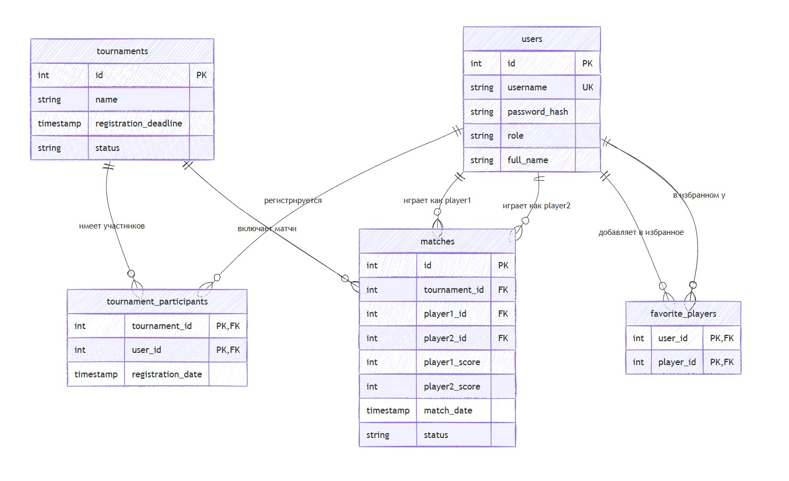

# TennisFan

--------
Проект для дисциплин “Введение в системы баз данных” и “Технологии Интернет и WEB-программирования”. Проект является
индивидуальным.

Для запуска проекта необходимо:

- установить vue, npm, а затем зависимости проектa tf-frontend с помощью команды `npm install`
- развернуть базу данных PostgreSQL (данные вводить не нужно - накатываются автоматически при запуске приложения)
- установить Java и зависимости проекта tf-backend из pom.xml
- запустить приложение tf-backend `mvn spring-boot:run`
- запустить приложение tf-frontend `npm install`  и `npm run dev`
- для просмотра документации в Swagger запустить tf-backend и открыть http://localhost:8081/swagger-ui/index.html#/

По умолчанию приложение будет запущено на порте `8081`, фронт - на порте `5173`

--------

# 1. Описание

## Наименование проекта: "TennisFan".

### Предметная область:

Сервис предназначен для теннисных фанатов. Обеспечивает ручную агрегацию информации о теннисистах, турнирах и матчах.
Пользователи могут отслеживать своих любимых игроков и получать персонализированную ленту матчей.

В качестве примера используются некоторые последние (на 17.12.2025) данные о мировых турнирных матчах и теннисистах, но
может найти применение в небольших теннисных клубах для хранения информации о клубных игроках.

--------

# 2. Данные

### Таблица users:

| Ключ            | Атрибуты                                                                        |
|-----------------|---------------------------------------------------------------------------------|
| `id`            | SERIAL PRIMARY KEY                                                              |
| `username`      | VARCHAR(15) UNIQUE NOT NULL                                                     |
| `password_hash` | VARCHAR(19) NOT NULL                                                            |
| `role`          | VARCHAR(10) NOT NULL CHECK (role IN ('USER', 'MEMBER', 'ADMIN')) DEFAULT 'USER' |
| `full_name`     | VARCHAR(100) NOT NULL                                                           |

### Таблица tournament_participants:

| Ключ                | Атрибуты                                         |
|---------------------|--------------------------------------------------|
| `tournament_id`     | INT REFERENCES tournaments(id) ON DELETE CASCADE |
| `user_id`           | INT REFERENCES users(id) ON DELETE CASCADE       |
| `registration_date` | TIMESTAMP DEFAULT CURRENT_TIMESTAMP              |
|                     | PRIMARY KEY (tournament_id, user_id)             |

### Таблица tournaments:

| Ключ                    | Атрибуты                                                                                                                         |
|-------------------------|----------------------------------------------------------------------------------------------------------------------------------|
| `id`                    | SERIAL PRIMARY KEY                                                                                                               |
| `name`                  | VARCHAR(100) NOT NULL                                                                                                            |
| `registration_deadline` | TIMESTAMP                                                                                                                        |
| `status`                | VARCHAR(20) NOT NULL CHECK (status IN ('UPCOMING', 'REGISTRATION_OPEN', 'ONGOING', 'COMPLETED', 'CANCELLED')) DEFAULT 'UPCOMING' |

### Таблица matches:

| Ключ            | Атрибуты                                                                                                            |
|-----------------|---------------------------------------------------------------------------------------------------------------------|
| `id`            | SERIAL PRIMARY KEY                                                                                                  |
| `tournament_id` | INT REFERENCES tournaments(id) ON DELETE CASCADE                                                                    |
| `player1_id`    | INT REFERENCES users(id) ON DELETE CASCADE                                                                          |
| `player2_id`    | INT REFERENCES users(id) ON DELETE CASCADE                                                                          |
| `player1_score` | INT                                                                                                                 |
| `player2_score` | INT                                                                                                                 |
| `match_date`    | TIMESTAMP                                                                                                           |
| `status`        | VARCHAR(20) NOT NULL CHECK (status IN ('SCHEDULED', 'IN_PROGRESS', 'COMPLETED', 'CANCELLED')) DEFAULT '  SCHEDULED' |
|                 | CONSTRAINT different_players CHECK (player1_id != player2_id)                                                       |

### Таблица favorite_players:

| Ключ        | Атрибуты                                   |
|-------------|--------------------------------------------|
| `user_id`   | INT REFERENCES users(id) ON DELETE CASCADE |
| `player_id` | INT REFERENCES users(id) ON DELETE CASCADE |
|             | PRIMARY KEY (user_id, player_id)           |

## Общие ограничения целостности:

- player1_id и player2_id в таблице matches не могут ссылаться на одного и того же игрока
- Уникальность пары user_id и player_id в таблице favorite_players
- Уникальность пары user_id и tournament_id в таблице tournament_participants

--------

# 3. Пользовательские роли

## USER (Пользователь)

#### Ответственность:

Регистрация, аутентификация, просмотр данных, управление своим списком избранных игроков

#### Количество:

Неограниченно (~95-99% от общей массы пользователей)

## ADMIN (Администратор)

#### Ответственность:

Все права USER + полное управление данными (CRUD для игроков и матчей), назначение других пользователей
администраторами и удаление пользователей

#### Количество:

Минимально (регулируется пользователями с такой же ролью)

--------

# 4. UI / API

### UI:

Веб-приложение со страницами: Лента матчей, Список игроков, Админ-панель.

### Backend:

REST API. Полностью - на http://localhost:8081/swagger-ui/index.html#/ (см. начало документа)

| Контроллер                                              | Эндпоинты                                                                                                                                                                                                                                                                                                                                                                                                                                                                                                                                                                                                     |
|---------------------------------------------------------|---------------------------------------------------------------------------------------------------------------------------------------------------------------------------------------------------------------------------------------------------------------------------------------------------------------------------------------------------------------------------------------------------------------------------------------------------------------------------------------------------------------------------------------------------------------------------------------------------------------|
| main-controller   (для проверки доступности сервера) | GET /                                                                                                                                                                                                                                                                                                                                                                                                                                                                                                                                                                                                         |
| admin-controller                                        | GET /api/admin/users   PUT /api/admin/users/{userId}/role   DELETE /api/admin/users/{userId}   GET /api/admin/matches   POST /api/admin/matches   PUT /api/admin/matches/{matchId}   DELETE /api/admin/matches/{matchId}   GET /api/admin/tournaments   POST /api/admin/tournaments   PUT /api/admin/tournaments/{tournamentId}   DELETE /api/admin/tournaments/{tournamentId}   POST /api/admin/tournaments/{tournamentId}/open-registration   POST /api/admin/tournaments/{tournamentId}/close-registration   GET /api/admin/tournaments/{tournamentId}/participants |
| favorite-controller                                     | POST /api/favorites/players/{playerId}   DELETE /api/favorites/players/{playerId}                                                                                                                                                                                                                                                                                                                                                                                                                                                                                                                          |
| auth-controller                                         | POST /api/auth/register   POST /api/auth/login                                                                                                                                                                                                                                                                                                                                                                                                                                                                                                                                                             |
| tournament-controller                                   | GET /api/tournaments   GET /api/tournaments/active                                                                                                                                                                                                                                                                                                                                                                                                                                                                                                                                                         |
| player-controller                                       | GET /api/players   GET /api/players/club   GET /api/players/{playerId}                                                                                                                                                                                                                                                                                                                                                                                                                                                                                                                                  |
| match-controller                                        | GET /api/matches   GET /api/matches/favorites                                                                                                                                                                                                                                                                                                                                                                                                                                                                                                                                                              |
| member-controller                                       | GET /api/member/tournament-status   POST /api/member/register-for-tournament   GET /api/member/my-matches   GET /api/member/tournament-history                                                                                                                                                                                                                                                                                                                                                                                                                                                       |

--------

# 5. Технологии разработки

#### Фронтенд: `Vue 3`

#### Бэкенд: `Java 21` + `Spring Boot`

#### СУБД: `PostgreSQL`

--------
